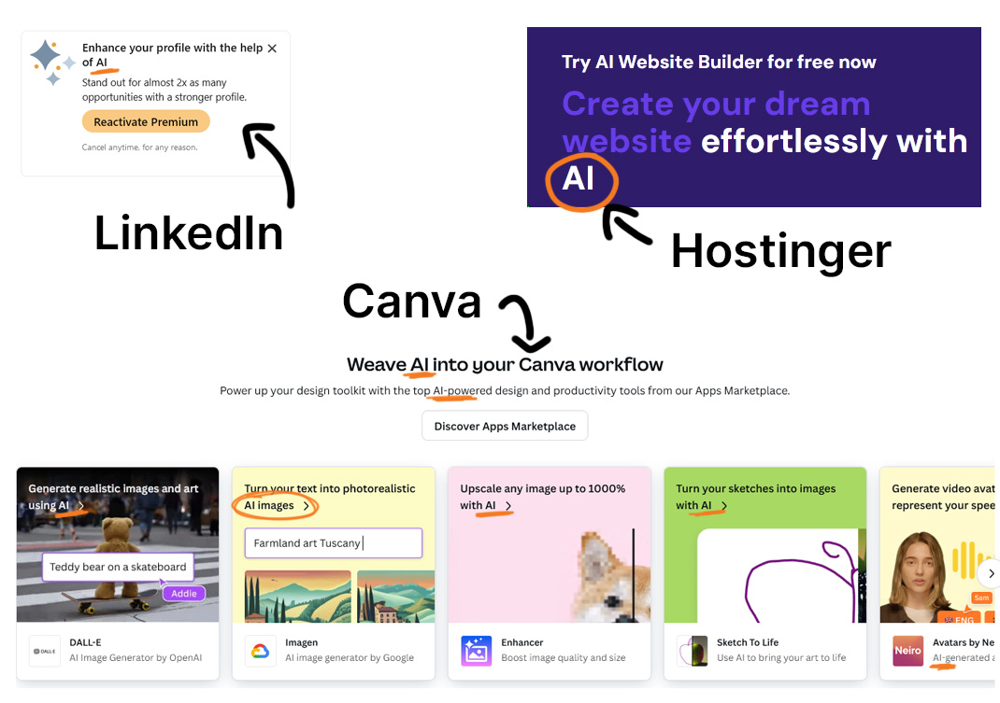

## AI's Growing Presence in Web Design

In recent years, we’ve seen AI step into the creative realm with tools like AI-powered design assistants, chatbots, and automated content generation. Some platforms allow users to create websites with just a few clicks by letting AI handle the design and structure based on user inputs. Sounds convenient, right? For someone without technical skills or a big budget, AI can be a lifesaver. But it also raises the question: Can AI really match the creativity and nuance of human design?

## The Advantages of AI in Web Development

One of the main advantages of using AI in web design is efficiency. AI tools can automate time-consuming tasks such as coding layouts, optimising images, and even analysing user data to improve website performance. For developers, this can mean more time to focus on the bigger picture: creating a more dynamic and personalised user experience.

Additionally, AI can help websites become more responsive to users' needs. Think of AI chatbots or recommendation engines that provide real-time, tailored responses to site visitors. These innovations can significantly improve customer engagement and satisfaction, making websites feel more like interactive experiences than static pages.

## Does AI Replace Creativity?

While AI excels at automating technical processes, one of the biggest concerns is whether it can replace human creativity. Web design isn’t just about arranging text and images; it’s about creating an emotional connection and an intuitive experience for users. AI can help streamline certain aspects of design, but it’s the human touch that adds that extra level of empathy and creativity.

For example, AI might suggest a colour palette based on user preferences or industry trends, but would it know how to capture the unique personality of your brand? In my experience, design is often about storytelling, and while AI can assist, it might not always capture the full narrative you're trying to convey.

## AI and User Experience (UX)

When it comes to user experience, AI can be a powerful tool. It can analyse user behaviour and provide data-driven insights into what works and what doesn’t. This helps developers fine-tune websites to meet user needs more precisely. However, the question remains: Is this purely data-driven approach always better than the intuition and feedback-driven method that designers and developers have relied on for years?

## Is AI Just a Gimmick?

These days, it seems like everyone is incorporating AI into their marketing strategies. From AI-powered chatbots to "smart" design tools, AI is being used as a buzzword to grab attention and show innovation. But is AI truly transformative, or is it simply the latest trend? The reality is that while AI can be powerful, it's important to ask if it's always necessary. For some businesses, AI-driven design may feel like a gimmick or over-complication. For others, it can provide real value. As more companies jump on the AI bandwagon, it’s worth considering whether the technology is being used thoughtfully or just to follow the hype.

## Finding Balance: AI and Human Collaboration

In my view, the best approach may be a collaboration between human creativity and AI efficiency. AI can handle repetitive, data-driven tasks, freeing up designers and developers to focus on the more nuanced aspects of the project, such as aesthetics, usability, and storytelling.

AI is great for speeding up workflows and making certain tasks easier, but it’s not a replacement for human expertise. In web design and development, it’s the combination of both that will lead to the best outcomes. After all, a website isn’t just about what works; it’s about how it makes people feel, and that’s something only a human touch can truly master.

## What Do You Think?

So, is AI a game changer in web design and development, or just another tool in the toolkit? It’s worth considering how you view the role of AI, whether as a time-saving assistant, a creative partner, or just a tool for automation. The important thing is to recognise the strengths and limitations of both AI and human designers, and figure out where the balance lies for you.

At the end of the day, the integration of AI into web design is a personal choice. What works for some might not work for others, and it’s up to each of us to decide where we want to draw the line between automation and human creativity. What are your thoughts on AI in web design? Feel free to leave a message on one of our social media posts!
